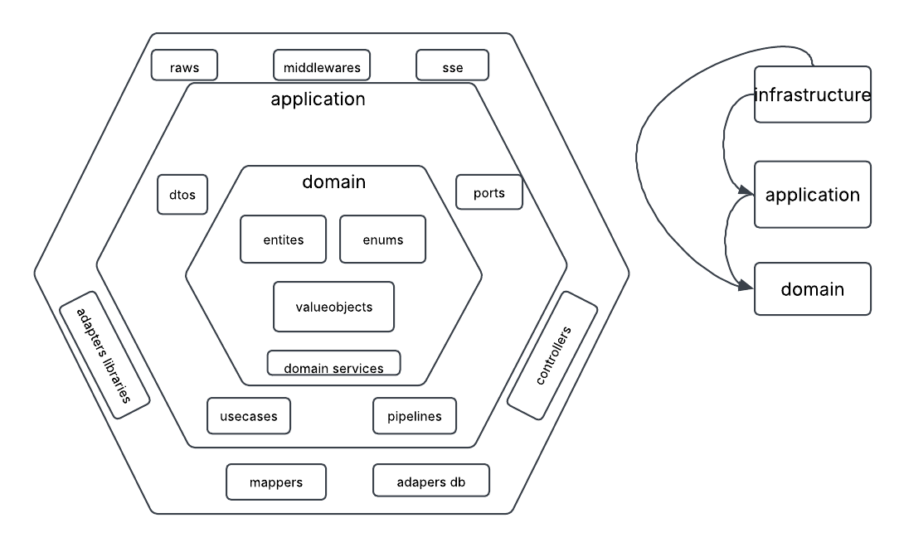

# scrapper-ai

Backend en **Go** con arquitectura **hexagonal + DDD + modular**: módulos autocontenidos
(`domain` / `application` / `infrastructure`) con inyección de dependencias por bootstrap,
expuestos por HTTP (chi) — hoy con el módulo **auth** completo (JWT + rotación de tokens).

| | |
|---|---|
| Lenguaje | Go 1.26 · chi · GORM (pgx) · golang-migrate |
| BD | PostgreSQL 16 (schema `dw_lubrisur`) |
| Auth | access JWT 5 min · refresh 72 h · refresh code rotativo |
| Runtime | binario estático en imagen `scratch` (~9 MB), no-root |

---

## Requisitos

- **Docker + docker compose** (forma recomendada), o
- **Go ≥ 1.26** si querés correr la app en local sobre una BD propia.

---

## Cómo se levanta todo

### Opción A — Docker (recomendada: BD + backend)

```bash
# 1. configurar envs (obligatorio: JWT_SECRET)
cp .env.example .env
#    completar JWT_SECRET (p. ej.: openssl rand -hex 32)
#    y DB_PASSWORD (la misma que usa el servicio db)

# 2. levantar todo (espera a que la BD esté healthy y corre migraciones sola)
docker compose up -d

# 3. verificar
docker compose ps                       # app y db → (healthy)
curl http://localhost:3000/health       # {"status":"ok"}
```

- `db`: `postgres:16-alpine`, volumen `pgdata`, creado el schema `dw_lubrisur` en el
  primer arranque (`docker/db/init/`), publicado **solo en 127.0.0.1:5432**.
- `app`: build del `Dockerfile` (imagen `scrapper-ai:prod`), puerta `:3000`,
  `restart: unless-stopped`, graceful shutdown con `SIGTERM`.
- Las migraciones (`config/db/migrations`) **se aplican solas al arrancar**.

```bash
docker compose logs -f app     # ver logs
docker compose down            # parar (el volumen pgdata persiste)
docker compose down -v         # parar y borrar la BD
```

### Opción B — solo la BD en Docker, app en local

```bash
cp .env.example .env
# ENVIROMENT=development  (para no requerir JWT_SECRET)
# DB_PASSWORD = el mismo que usás en compose

docker compose up -d db       # solo Postgres en :5432

go run ./cmd/server           # correr SIEMPRE desde la raíz del proyecto
```

> El binario resuelve `config/db/migrations` y `.env` relativos al **cwd**:
> ejecutar desde la raíz, no desde `cmd/server`.

---

## Probarlo rápido

```bash
curl -i -X POST http://localhost:3000/auth/register \
  -H "Content-Type: application/json" \
  -d '{"userName":"jean","password":"secret123"}'
# 201 + accessToken en body + X-Refresh-Token / X-Refresh-Code en headers

curl -i -X POST http://localhost:3000/auth/login \
  -H "Content-Type: application/json" \
  -d '{"userName":"jean","password":"secret123"}'

curl -i http://localhost:3000/auth/refresh-token \
  -H "X-Refresh-Token: $REFRESH_TOKEN" \
  -H "X-Refresh-Code: $REFRESH_CODE"
```

Build/chequeo: `go build ./... && go vet ./...`

---

## Variables de entorno

| Env | Requerido | Default | Descripción |
|---|---|---|---|
| `JWT_SECRET` | **en producción** | `default_secret_key` | sin él la app no arranca si `ENVIROMENT=production` |
| `ENVIROMENT` | no | `development` | `production` activa el guard de `JWT_SECRET` |
| `DB_USER` / `DB_PASSWORD` / `DB_NAME` | no | `postgres` / — / `postgres` | credenciales (las mismas del servicio `db`) |
| `DB_HOST` / `DB_PORT` / `DB_SSLMODE` | no | `localhost` / `5432` / `disable` | dentro del compose la app usa `DB_HOST=db` |
| `APP_PORT` | no | `3000` | puerto publicado del backend (el binario escucha en `:3000`) |
| `DB_PUBLISHED_PORT` | no | `5432` | puerto local de la BD (solo loopback) |
| `CORS_ORIGINS` | no | `localhost:34115`, `5173` | orígenes separados por coma |

---

## Índice de documentación

| Documento | Qué contiene |
|---|---|
| [Arquitectura](docs/resources/architecture-doc.md) | hexagonal + DDD + modular: capas, dominio, application (use cases, ports, pipelines), infra, bootstrap por módulo, `main`, `shared` y el flujo de una petición (+ diagrama) |
| [Auth](docs/resources/auth-doc.md) | cómo funciona auth **hoy**: las 3 credenciales, qué enviar/recibir en cada flujo, headers, rotación, reglas para el cliente Wails, catálogo de errores |
| [Endpoints](docs/resources/endpoints-doc.md) | referencia de rutas (request/response/errores), curl, correr con Docker y tabla de envs |



---

## Estructura

```
cmd/server/main.go     → composition root: globales + r.Mount de cada bootstrap
config/                → envs, conexión GORM, migraciones (golang-migrate), modelos
docker/                → init de BD + compose
modules/
├── auth/              → domain | applicastion | infrastructure + auth_module.go (bootstrap)
└── shared/            → value objects, errores, mappers y validator compartidos
docs/resources/        → esta documentación
```

Detalle por capa en [docs/resources/architecture-doc.md](docs/resources/architecture-doc.md).
